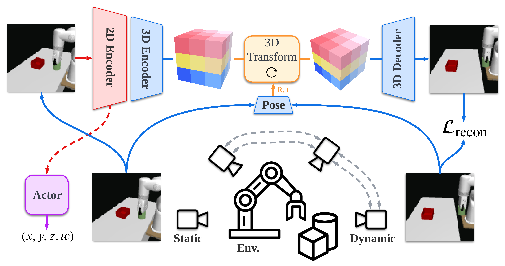

# Visual Reinforcement Learning with Self-Supervised 3D Representations
Original PyTorch implementation of **RL3D** from

[Visual Reinforcement Learning with Self-Supervised 3D Representations](https://yanjieze.com/3d4rl/) by

[Yanjie Ze](https://yanjieze.com/)\*,   [Nicklas Hansen](https://nicklashansen.github.io/)\*,   [Yinbo Chen](https://yinboc.github.io/),   [Mohit Jain](https://natsu6767.github.io/),   [Xiaolong Wang](https://xiaolonw.github.io/)

<p align="center">
  <br><br>
</p>

## Method
RL3D is a framework for visual reinforcement learning (RL) using a pretrained 3D visual representation and jointly training with an auxiliary view synthesis task. RL3D could generate novel view synthesis for diverse RL tasks and achieve good sample efficiency, robustness to sim-to-real transfer, and generalization to unseen environments.


## Instructions

Assuming that you already have [MuJoCo](http://www.mujoco.org) installed, install dependencies using `conda`:

```
conda env create -f environment.yaml
conda activate rl3d
```

After installing dependencies, you can train an agent by using the provided script
```
bash scripts/train.sh
```

Evaluation videos and model weights can be saved with arguments `save_video=1` and `save_model=1`. Refer to the `arguments.py` for a full list of options and default hyperparameters.

The training script supports both local logging as well as cloud-based logging with [Weights & Biases](https://wandb.ai). To use W&B, provide a key by setting the environment variable `WANDB_API_KEY=<YOUR_KEY>`, set `use_wandb=1`, and add your W&B project and entity details in the script.


## Pretrained Model

Import the encoder in our pretrained 3D visual representation
```python
import load_3d
encoder_2d = load_3d.visual_representation(ckpt_path="checkpoints/videoae_co3d.tar", use_3d=False)
```
You could set `use_3d=True` to use the 3D encoder. The encoder is trained on the [CO3D](https://ai.facebook.com/datasets/CO3D-dataset/) dataset.

## Tasks
We provide our xArm environments for sim-to-real experiments in our paper. The task name and the action space are listed below:
- `reach` (xyz)
- `push` (xy)
- `pegbox` (xyz)
- `lift` (xyzw)

## License & Acknowledgements
RL3D is licensed under the MIT license. MuJoCo is licensed under the Apache 2.0 license. 


